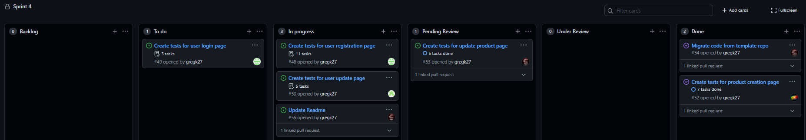

# Assignment 4 Stand-Up meeting

## Greg
 - Has been working on branch `testUpdateProduct`
 - Writing tests for product update page
 - PR open and awaiting review at time of meeting
    - Contains 3 tests
 - No issues at time of meeting
 - Plans to make changes required on PR once review is complete

## Damien
 - Has been working on branch `damienA4`
 - Writing tests for user registration and login pages
 - Completed 2 tests at time of meeting
 - No issues at time of meeting
 - Plans to finish tests by thrusday and open PR

## Divay
 - Has been working on branch `divay`
 - Writing tests for user modification page
 - Completed 2 tests at time of meeting
 - No issues at time of meeting
 - Plans to finish tests by thrusday and open PR

## Dennis
 - Was been working on branch `dennis-a4`
 - Wrote tests for product creation page
 - PR has been merged at time of meeting
   - Contained 6 tests
 - Some difficulties with preexisting bugs in price input field, but these were resolved before the meeting

# Kanban Board
