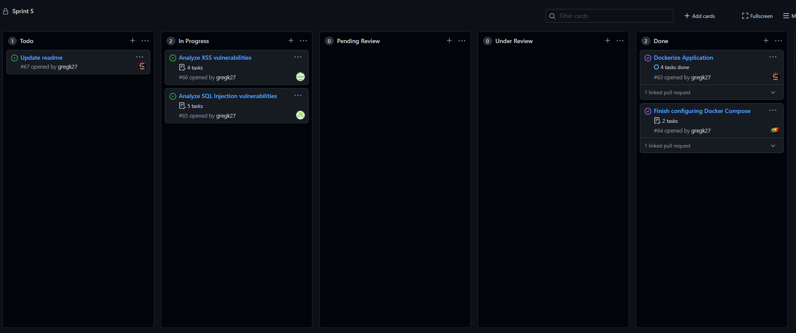

# Assignment 5 Stand-Up meeting

## Greg
 - Was working on branch `dockerization`
 - Built and tested docker image
 - PR merged at time of meeting
 - Encountered some issues with dependencies
   - Resolved by adding commands to install ImageMagick with apt
 - Plans to review PRs as they open

## Damien
 - Has been working on branch `damienA5`
 - Analyzing threats from XSS injection
 - Branch created, not ready for PR at time of meeting
 - Encountering significant issues with pwnxss
   - Appears to be an internal bug with library when running analysis
   - Same error as [pwnxss #26](https://github.com/pwn0sec/PwnXSS/issues/26)
 - Plans to finish analysis by friday night and open PR

## Divay
 - Has been working on branch `divay`
 - Analyzing threats from SQL injection
 - Branch created, not ready for PR at time of meeting
 - No issues at time of meeting
 - Plans to finish analysis by friday night and open PR

## Dennis
 - Was working on branch `dennis-a5`
 - Configured and tested docker compose
 - PR has been merged at time of meeting
 - Encountered difficulties with MySQL initialization
   - Resolved by reducing size of review comment field

# Kanban Board
