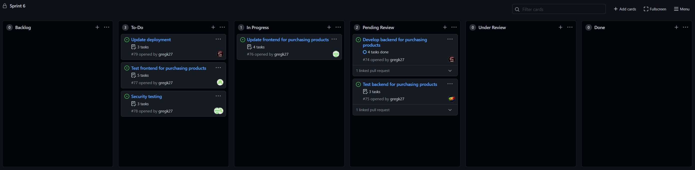

# Assignment 5 Stand-Up meeting

## Greg
 - Was working on branch `purchase-backend`
 - Developed backend function to handle product purchasing
 - PR open at time of meeting
 - No difficulties encountered
 - Plans to update docker image when development is complete, and review PRs as they open

## Damien
 - Has been working on branch `damienA6-frontent`
 - Added the purchase button and connected it to backend method
 - Branch created, working on exception handling
 - No difficulties at this time
 - Plans to update product listings and add confirmation before opening PR, and perform XSS checks  

## Divay
 - Has been working on branch `purchase-frontend-test`
 - Will develop tests for fronend functionality using Selenium
 - Branch created, not ready for PR at time of meeting
 - No issues at time of meeting
 - Plans to begin development when frontned is closer to completion, and perform SQL injection checks

## Dennis
 - Was working on branch `purchase-backend`
 - Created tests for the backend product purchase function
 - PR open at time of meeting
 - Encoutered issues with exception detection in unit tests
   - Resolved by using `pytest.raises()`
 - Plans to review PRs as they open

# Kanban Board
