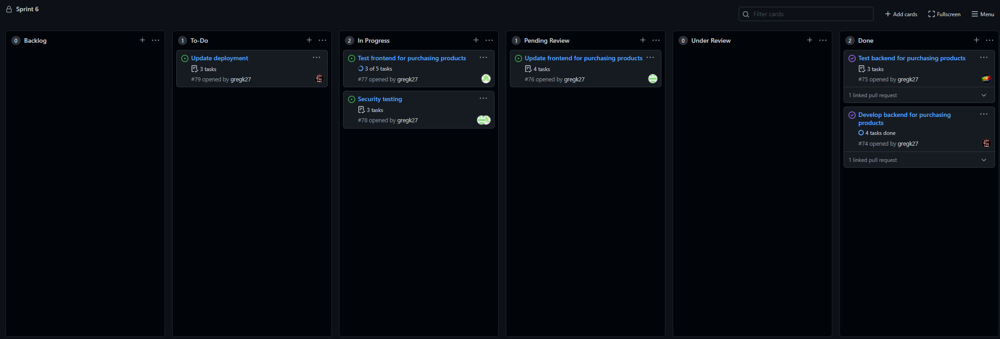

# Assignment 6 Stand-Up meeting

## Greg
 - Was working on branch `purchase-backend`
 - Developed backend function to handle product purchasing
 - PR merged
 - No difficulties encountered
 - Plans to update docker image when development is complete, and review PRs as they open

## Damien
 - Has been working on branch `damienA6-frontent`
 - Added frontend components for purchasing products, has completed XSS checks
 - PR Open, pending review of changes at time of meeting
 - No difficulties at this time
 - Plans to continue working to get PR merged  

## Divay
 - Has been working on branch `purchase-frontend-test`
 - Developing tests for frontend functionality using Selenium, has completed SQL Injection checks
 - Branch created, not ready for PR at time of meeting
 - Encountering issues with Selenium, not resolved at time of meeting
 - Plans to complete tests after next exam

## Dennis
 - Was working on branch `purchase-backend`
 - Created tests for the backend product purchase function
 - PR merged
 - Some tests were missing in PR
  - Tests added per feedback in review
 - Plans to review PRs as they open

# Kanban Board
